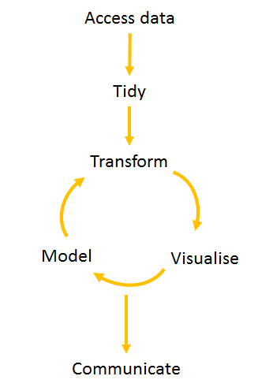

```{r setup, include=FALSE}

library(tidyverse)
library(PCcharts)

knitr::opts_chunk$set(echo = FALSE)

```

## Why R? { .build}


<div class = "centred">
   
</div>

Preaching to the choir


## Why R? { .build}

> - Reproducible work (often much quicker)
> - Quality assurance
> - Work is easily updated
> - Works well with report writing processes
> - Easy movement of data into/out of other formats
> - Useable graphic outputs


## tRansition issues

**Fear of change**


## tRansition issues {.build}

> - Legacy programs
> - Existing skills
> - Training
> - Skill development

</div>


## What even is a workflow?

<div class="columns-2">
  

What is involved in each of these steps?

What barriers are there to using R?

  - Minimise repetition; scope for error; unneccessary work
  - Personal preferences vs Outputs

</div>

<!-- Distinguish between: -->

<!-- - Personal preferences -->
<!--       + Text editor/IDE -->
<!--       + Directory names -->

<!-- - Outputs/Product -->
<!--       + Raw data -->
<!--       + R code necessary to reproduce results (incl. libraries) -->

## Supportive environment is critical

**Computing**

- Access to R Studio
- Access to packages, internet proxies
- Version control software


**Work**

- Culture of learning
- R user group ('Community of interest')
      + Webpage
      + Regular interactive sessions
      + Sharing expertise between teams

## Supportive environment is critical

**In order to achieve this, you need to sell the benefits**

- Reproducible, auditable work

- Open source software

- Efficiency gains

- Knowledge sharing

## Tidyverse {.build}

- Changed how data is imported, tidied, transformed, visualised
- Common standard for data manipulation
- Human 'readable' code

```{r ExampleChunk, echo=TRUE, eval = FALSE, message=FALSE, warning=FALSE, paged.print=FALSE}

table <- SurveyFrame %>%
   # Group by two factor variables
   group_by(Response, Profit.status) %>%                           
   # Summarise 
   summarise(`Total assets` = sum(Total_assets, na.rm=TRUE),       
             `Accounts` = sum(N_Accounts, na.rm=TRUE)/1000,
             `Number of funds` = n() ) %>%
   # Turn into percentages
   mutate_if(is.numeric, funs(`(%)` = round(./sum(.)*100, 2) ) )   

```

## R Studio 

- Ease of managing R sessions, accessing files, outputs

**Projects!**

- One folder/project
- Transferable work

   + No more `setwd`
   + Use `here` package to build portable paths within projects
   
- Multiple projects at once

## Version control

- Access git from within R Studio

- Link with github/gitlab

- Requires support of IT

- Ease of sharing code/collaborating

## Style management

- Fundamental to integration of R with other work

- `PCcharts` package produces standard graphics with `ggplot`

```{r echo=FALSE, message=FALSE, warning=FALSE, paged.print=FALSE}

a <- read_csv("admin_perc_plot_stack_data.csv") %>% 
   ggplot( aes(x=Year, y = `Expenses (% of total assets)`, fill = Service_Source) ) +
   geom_col( position="stack") +
   facet_wrap(vars(Profit.status)) +
   PC.theme.bar() +
   scale_fill_manual(values= c("#66bcdb", "#78a22f", "#e0b123") ) +
   labs(x=NULL, y="Administration expenses (% of total assets)") +
   scale_y_continuous( expand = c(0, 0), limits=c(0,2) ) +
   theme(legend.spacing.x = unit(0.2, "cm")) +
   geom_text( aes(label=Percent), colour = "snow", size=3.6, position = position_stack(vjust = 0.5))
a

```


## R Markdown

- Reproducible record of work within R
- Outputs accompanied by text
- Report in a range of formats
      + html; docx; pdf; ioslides

- Share R outputs with non-R users
- Easy revision/updates

We will have a closer look at using R Markdown today 

## Interactive data exploration

- Better understanding of raw data
- Tool for cleaning
- Means of sharing complex data

Different approaches: 

- Shiny
- plotly
