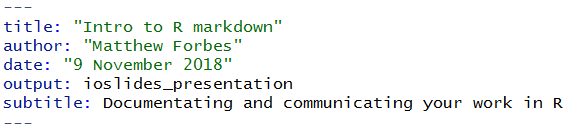
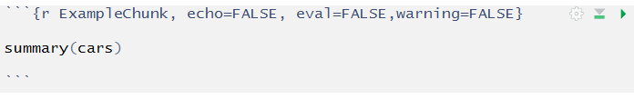
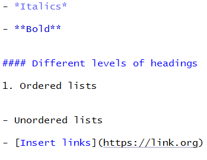
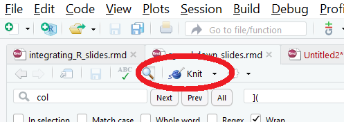
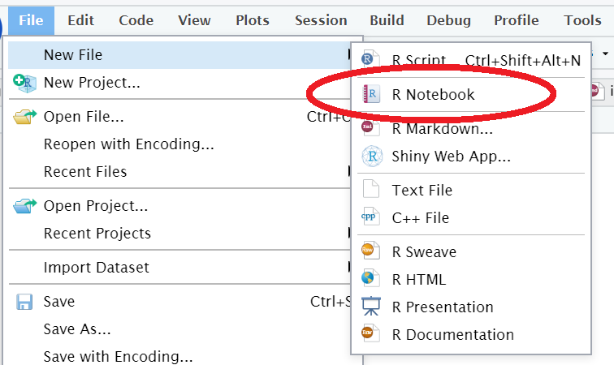
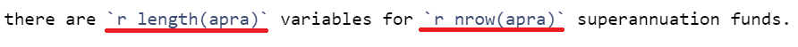
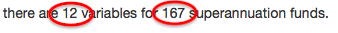
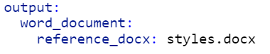
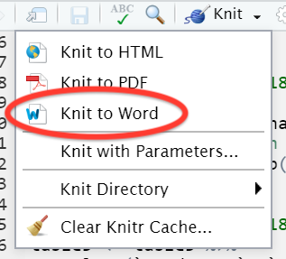

   
```{r setup, include=FALSE}

knitr::opts_chunk$set(echo = FALSE)

```

## What are the problems here?

<!-- There are two aspects of using R for day-to-day data analysis that we are going to look at in this part of the session. 

The first is a potential barrier to using R on a daily basis, and the second is an unequivocal advantage of R over Excel, and also many other script-based programs such as Stata and SAS.

-->
   
1. Getting work into publishable formats

      + Copy and paste (???)
      + Write to Excel/csv >> More tidying >> Move into Word (???)

<!-- R is a fantastic platform for doing work in, with its' various graphics capabilities the fact that it is script- rather than cell-based. -->
<!-- It is open source, cutting edge, has powerful programming capacity that is not necessarily there in Excel or other platforms.  -->

<!-- But, it can be a real hassle getting your R outputs into publishable formats. -->
<!--    - Do you output things into csv files and then make tables/plots in Excel? -->
<!--    - View >> Copy >> Paste tables into Word >> Format ...  -->

2. Documenting data work

      + Reproducibility makes things easier
      + Iterative improvements
      + Updateable

<!-- This is important. It might not seem like it in the short term, as you can bash something out quickly in Excel, but reproducibility makes things easier and more efficient in the medium to long turn. -->
<!-- I would put it to you that: -->
<!-- 1. You will rerun almost every bit of data work that you do at least several times -->
<!-- 2. Colleagues may need to revisit your work -->
<!--       - The old, what if I go under a bus test -->
<!--       - More realistically it is about revisiting work that has been done previously and colleagues have moved on, or you have forgotten what was actually done.  -->
<!--       - I am willing to bet that pretty much everyone here has had to try and recreate a colleague's conclusions from an incomprehensible spreadsheet, and have spent ages working out what on earth has gone on here.  -->
   <!--       - Even more likely is the scenario that you are the person that is going to collaborate with your future self. You are not going to answer your own requests for help, and even if you do, you are going to have to work out what you did. 

-->
   
## What I'd like you to get out of this
   
- Become familiar with R Markdown
- Convert R script to R Notebook

      + Insert and execute code 'chunks'
      + Examine `.html` outputs

- Use inline code to make a dynamic document

- `knit` Markdown output to Word

## What is R Markdown?

<!-- It is *not* the Messiah, but it is pretty useful

- Simplified 'markup' language
- Syntax for formatting plain text 
- Easy-to-read easy-to-write plain text that is converted to HTML
- Software written in Perl to convert plain-text formatting to html -->
   
A language for creating documents in R Studio

- Plain-text formatting syntax
- Text-to-HTML conversion tool
- Focus on content

Generate files in a range of output formats:
   
- html; docx; pdf; slides
- **R Notebooks**
   
## Yes, but why? (1)
   
`.rmd` allows you to combine executable code with narrative text.

- Text added as analysis proceeds
- Organising plots, tables, widgets
- Share code and outputs in **one** file!

      + Including widgets!
   
## Yes, but why? (2)
   
<!-- But I put comments in my scripts ... -->
   
<div class="columns-2">
   
**Conventional script**
   
- Read my terse, ambiguous comments

*(Work out what is actually going on here??)*
   
- Fish around for the outputs in a project directory

\

\


**R Notebooks**
   
- Here is some code. Let me tell you about it
- Execute this chunk, then show the output
- Put everything in one, reproducible document


</div>
   
**Lessens the divide between R and other programs**
   
   
## Parts of an R Markdown document
   
- YAML header (surrounded by `---`)


   
- Narrative text, with simple formatting

- Code chunks (surrounded by ` ``` `)


   
## Markdown formatting
   
<div class="columns-2">
   
- *Italics*
- **Bold**
   
#### Different levels of headings
   
1. Ordered lists

- Unordered lists
- [Insert links](https://link.org)




## Using `.rmd`

All in R Studio

- R Studio has `knitr` and `rmarkdown` embedded in it

- `knitr` package is used to evaluate the R Markdown file

- `Preview` button can be used for `R Notebooks`


   
   
## R Notebooks: reproducible analyses
   
- `R Notebooks` combine narrative, code and output
- All included in **one** `.nb.html` file 

Task:
   
1. Create R Notebook

2. Convert script file into Notebook

3. Examine output

## Open RStudio server session

url: <http://pc.gov.au/agec>
   
**Use unique login details on paper slip from Henry**
   
## Create R Notebook
   

   
<!-- Inspect the elements of the notebook. -->
<!--    - YAML eader -->
<!--    - Narrative elements, with markdown formatting -->
<!--    - Code chunk -->
   
   
## Inspect rendered output
   
<!-- 
To inspect the rendered output, you need to look at the 'Preview' of the document.

If you hit the Preview button, you can see that it can't give you a preview without the Notebook first being saved. 

You might want to save it as `test.notebook.rmd` -->

- Save as `test.notebook.rmd`

- Hit `Preview` button

- Output should be in `Viewer`

<!-- Output is shown in viewer -->
<!-- Show in New window allows you to view the preview -- which is just an html document -- in a web browser. -->
<!-- You can also see in the file explorer window that there is not only a test.notebook.rmd document, but also a test.notebook.nb.html document -->

## Turn script file into a Notebook

- Open `script.R` from project folder, and turn into a Notebook:

      + Open `blank.notebook.rmd`
      + Paste in code from `script.R`
      + Insert code chunks where necessary

      
- If you get stuck, refer to `completed.notebook.rmd`

## In-line evaluation

- Insert code into narrative for dynamic text

- This: 



- Will render as:




## Render Notebook

-  Run all chunks, then `Preview`

      + Alternatively `Knit to html`

- Inspect code / Download `.rmd` file

(You will not be able to download `.rmd` file if you use `knit` rather than `Preview`)

## Output as Word document

- Suppress code display

      + `echo=FALSE` in code chunk headers

- Change YAML header: 



-  To develop style reference document see here: 
      https://rmarkdown.rstudio.com/articles_docx.html
      

- Save, then `Knit to Word`: 

## Take home messages

- R Notebooks allow combination of code, narrative and output in one document

- Promotes documented and reproducible work

- `.rmd` helps remove barriers between R and Word

      + Reduces double handling
      + Quicker, less scope for error
      + **Makes your life easier**
      

## Markdown resources

- [R Markdown: The Definitive Guide](https://bookdown.org/yihui/rmarkdown/)
- [John Gruber](https://daringfireball.net/projects/markdown/)
- [Collaboration from R Markdown to Word](https://rmarkdown.rstudio.com/articles_docx.html)
- [R Markdown cheat sheet](https://www.rstudio.com/wp-content/uploads/2016/03/rmarkdown-cheatsheet-2.0.pdf)
- [Intro to R Markdown](https://shiny.rstudio.com/articles/rmarkdown.html)
- [Ch27 - R for Data Science](https://r4ds.had.co.nz/r-markdown.html#r-markdown)

<!-- ## Other resources just for me -->

<!-- - [Reproducible reporting](https://bioconnector.github.io/workshops/r-rmarkdown.html) -->
<!-- - [Adding an image to R markdown](https://rpubs.com/RatherBit/90926) -->
<!-- - [Adding citations to R markdown documents](https://www.r-bloggers.com/writing-manuscripts-in-rstudio-easy-citations/) -->
<!-- - [Intro tutorial to Rmd](http://www.jacolienvanrij.com/Tutorials/tutorialMarkdown.html) -->
<!-- - [Using Git and GitHub with R, RStudio, and R Markdown](https://www.r-project.org/conferences/useR-2016/tutorials/01.html) -->
<!-- - [Rmd and Zotero](https://github.com/bbest/rmarkdown-example) -->
<!-- - [Why I love R Notebooks](https://rviews.rstudio.com/2017/03/15/why-i-love-r-notebooks/) -->
<!-- - [More on Notebooks](https://minimaxir.com/2017/06/r-notebooks/) -->
<!-- - [Jim Savage](http://modernstatisticalworkflow.blogspot.com/2016/08/what-is-modern-statistical-workflow.html) -->
<!-- - [New Learning - Knowledge processes](http://newlearningonline.com/learning-by-design/the-knowledge-processes/) -->